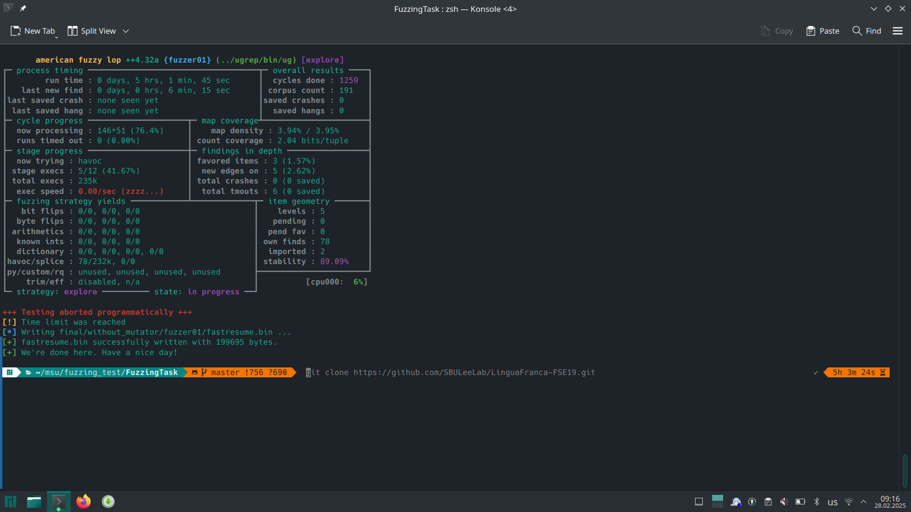
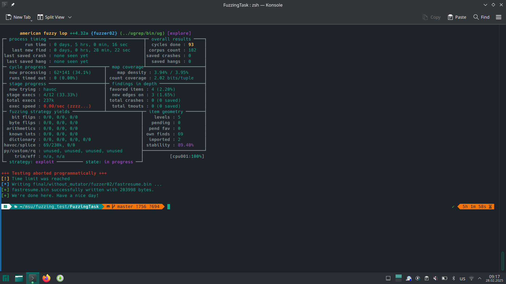
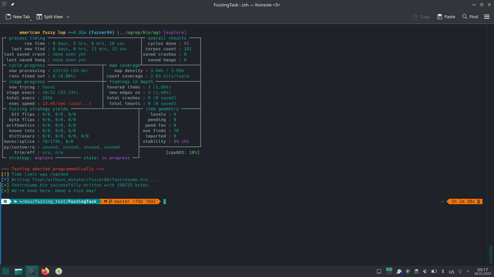
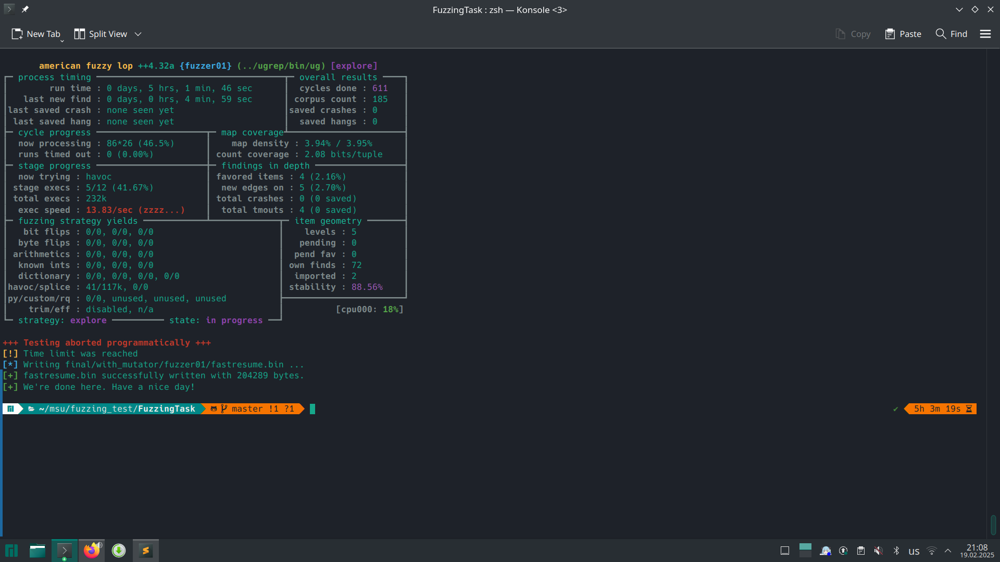
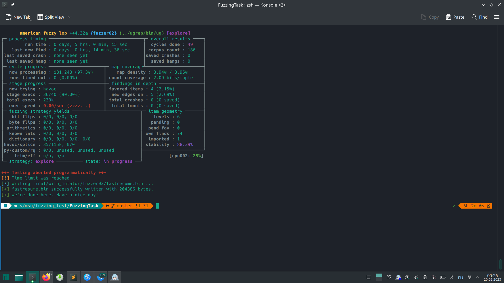
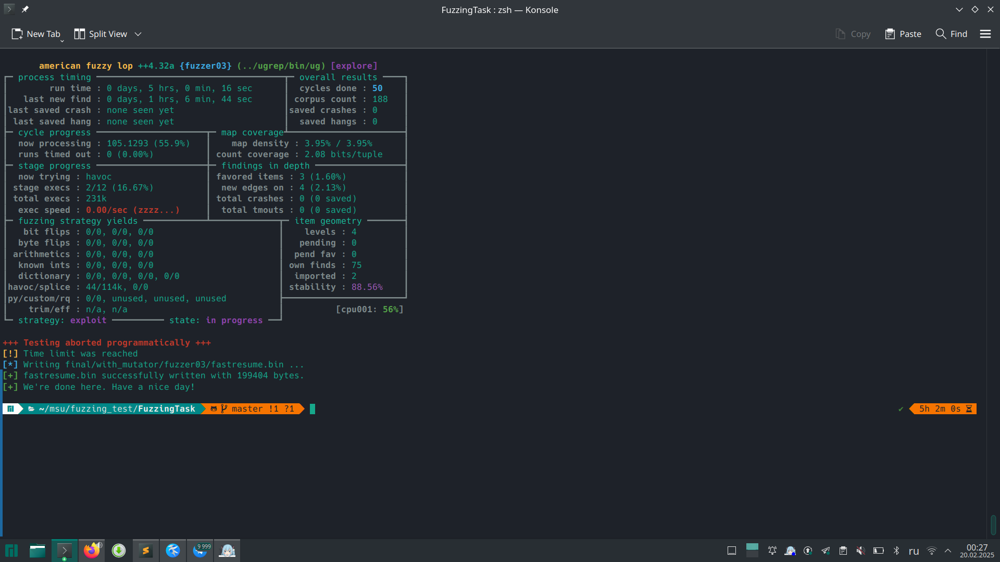
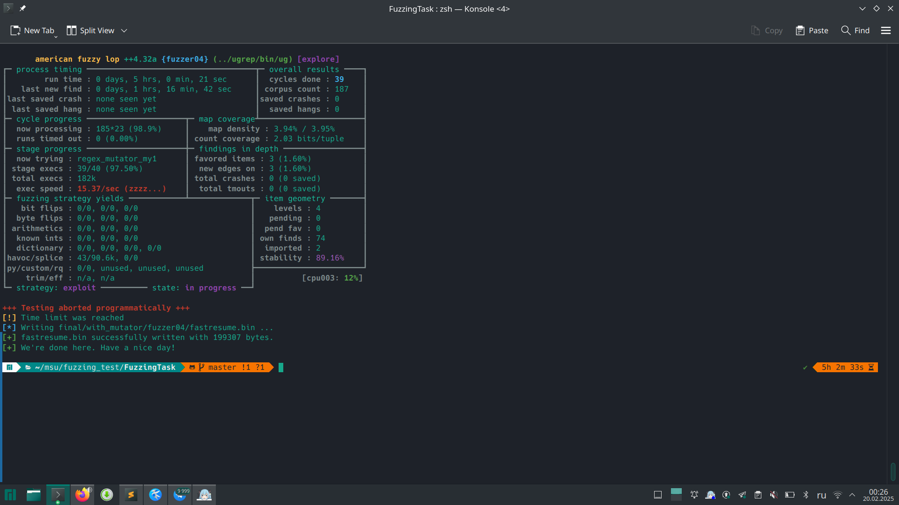
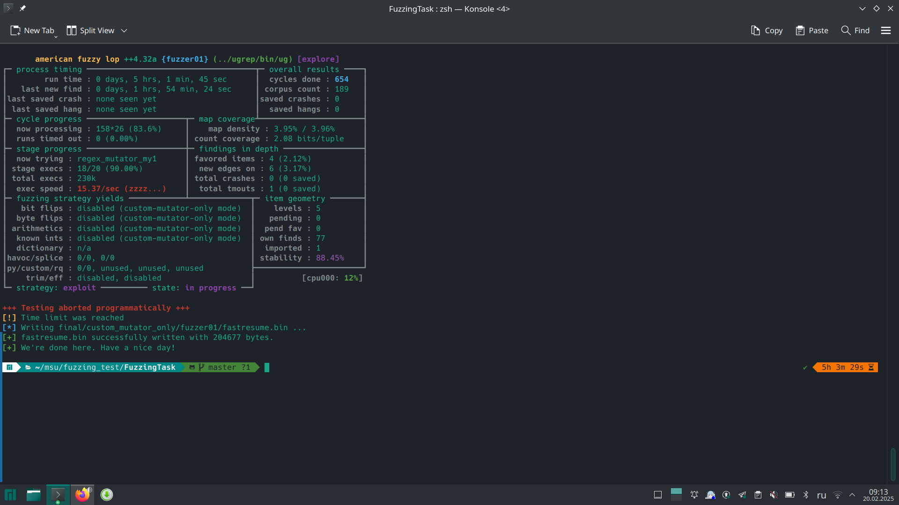
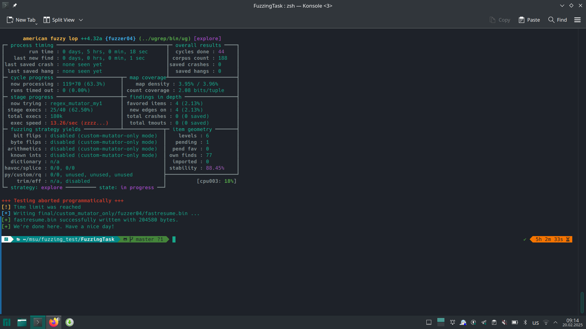

<div dir="ltr" align=center>
    
[**English 🇺🇸**](README.md) / [**Русский 🇷🇺**](README_RU.md)

</div>
<br>

# Selected Project

The chosen project is `ugrep` (https://github.com/Genivia/ugrep), which is a utility for searching within files with support for regular expressions. It is a C++ project with a user-friendly CLI interface, making it suitable for fuzzing since it accepts textual input.

# Step-by-step instructions

1. **Directories' tree**
```shell
fuzzing_test			# =: FT
├── AFLplusplus
├── FuzzingTask			# this repo
├── LinguaFranca-FSE19
├── sample-programs
└── ugrep
```
2. Install `AFLplusplus`
```shell
# https://github.com/AFLplusplus/AFLplusplus/blob/stable/docs/INSTALL.md
git clone https://github.com/AFLplusplus/AFLplusplus.git
cd AFLplusplus
make
# OR
make PERFORMANCE=1
```
Make **shortcuts**:
```shell
cd /usr/local/bin/
sudo ln -s FT/AFLplusplus/afl-clang-fast .
sudo ln -s FT/AFLplusplus/afl-clang-fast++ .
sudo ln -s FT/AFLplusplus/afl-cmin .
sudo ln -s FT/AFLplusplus/afl-fuzz .
sudo ln -s FT/AFLplusplus/afl-showmap .
sudo ln -s FT/AFLplusplus/afl-whatsup .
cd FT
```
3. Install `ugrep` so that it can be ***fuzzed***
```shell
git clone https://github.com/Genivia/ugrep.git
cd ugrep
CC=afl-clang-fast CXX=afl-clang-fast++ ./build.sh --disable-shared
# To check
afl-showmap -o /dev/null -- ./bin/ugrep ugrepdsdfds
# OR
AFL_DEBUG=1 afl-showmap -o /dev/null -- ./bin/ugrep ugrepdsdfds
```
4. Generate some **text:**
```shell
python3 get_invalid_text.py
python3 get_valid_ascii.py
python3 get_valid_text.py
```
Get **code_samples:**
```shell
# https://github.com/TheRenegadeCoder/sample-programs/tree/main/archive
cd ..
git clone https://github.com/TheRenegadeCoder/sample-programs.git
cp sample-programs/archive FuzzingTask/input_texts/code_samples
cd FuzzingTask
```
5. Get **regexes**
```shell
# https://github.com/SBULeeLab/LinguaFranca-FSE19/tree/master/data/production-regexes
cd ..
git clone https://github.com/SBULeeLab/LinguaFranca-FSE19.git
cp LinguaFranca-FSE19/data/production-regexes/uniq-regexes-8.json FuzzingTask/
cd FuzzingTask
``` 
```shell
python3 get_some_regexes_1.py # It will get 1000 random regexes
```
**Minimize** regexes corpus to **111 (!):**
```shell
afl-cmin -i some_regexes -o unique_regexes -T all -- ../ugrep/bin/ug -nr --color=never -e @@ input_texts
```
6. **Fuzz!**
```shell
bash aflplusplus_system_tweak.sh # requires sudo
```

In different terminals (or using `tmux`), run:
```shell
bash run_without_mutations_1.sh
bash run_without_mutations_2.sh
bash run_without_mutations_3.sh
bash run_without_mutations_4.sh
```
Then
```shell
bash run_with_mutations_1.sh
bash run_with_mutations_2.sh
bash run_with_mutations_3.sh
bash run_with_mutations_4.sh
```
Then
```shell
bash run_custom_mutations_only_1.sh
bash run_custom_mutations_only_2.sh
bash run_custom_mutations_only_3.sh
bash run_custom_mutations_only_4.sh
```
7. Inspect the results in `final/`!
To obtain the results, I used the following commands:  

```shell
afl-whatsup final/custom_mutator_only > final/custom_mutator_only_summary.txt
afl-whatsup final/without_mutator > final/without_mutator_summary.txt 
afl-whatsup final/with_mutator > final/with_mutator_summary.txt 
```

### Coverage Results:

| #  | Method                                 | Coverage (%)|
|----|----------------------------------------|-------------|
| 1  | Standard (basic AFL++ mutations)       | 3.95%       |
| 2  | Standard + custom mutator              | 3.96%       |
| 3  | Custom mutator only                    | 3.97%       |

### Conclusions

These results show a slight increase in coverage, confirming the effectiveness of the custom mutator and the successful achievement of the task's goal!

### Screenshots

#### Standard

  
  
  
  

#### Standard + Custom Mutator

  
  
  
  

#### Custom Mutator Only

  
  
  
  

# Possible mutations

## **1. Flip Quantifier (`flip_quantifier.py`)**
### **What it does:**  
- Identifies regex quantifiers (`*`, `+`, `?`) and:
  - Replaces them with a different quantifier.
  - Randomly removes them.
  - Does not invalidate the regex.
  
### **Mutation Examples:**

| Input | Mutation | Changes |
|-------|----------|---------|
| `a+` | `a*` | `+` → `*` (Quantifier flipped) |
| `b?` | `b+` | `?` → `+` (Quantifier flipped) |
| `c*` | `c`  | - `*` (Quantifier `*` deleted) |

## **2. Handle Bracket Expression (`handle_bracket_expression.py`)**
### **What it does:**  
- Modifies bracket expressions (`[a-z]`) by:
  - Adding negation (`^`).
  - Replacing characters inside.
  <!-- - Adding a random character range. -->
  - Does not produce incorrect regexes

### **Mutation Examples:**

| Input | Mutation | Changes |
|--------|-----------|---------|
| `[a-z]` | `[^a-z]` | + `^` (Negation added) |
| `[0-9]` | `[1-9]` | `0` → `1` (Character modified) |
<!-- | `[aeiou]` | `[a-iu]` | (Inserted character range) | -->

## **3. Insert Known Token (`insert_known_token.py`)**
### **What it does:**  
- Randomly inserts known regex special characters (`^`, `$`, `*`, `[`, `]`, `{`, `}`, `|`, etc.).
- Inserts bracket expressions (`[]`), curly bracket repetitions (`{}`), or groupings (`()`).
- ***Tries*** not to invalidate the regex

### **Mutation Examples:**

| Input | Mutation | Changes |
|--------|-----------|---------|
| `1234` | `12*4` | + `*` (Inserted `*`) |
| `abc` | `a[xyz]bc` | + `[xyz]` (Inserted bracket expression) |
| `def` | `de{2,5}f` | + `{2,5}` (Inserted repetition) |
| `ghi` | `g(hi)` | + `(`, + `)` (Wrapped in parentheses) |

## **4. Invalidate Regex (`invalidate_regex.py`)**
### **What it does:**  
- Makes the regex invalid by:
  - Randomly inserting special characters.
  - Replacing a valid special character with another.
  
### **Mutation Examples:**

| Input | Mutation | Changes |
|--------|-----------|---------|
| `abc+` | `abc\\+` | + `\\` (Inserted invalid escape) |
| `[a-z]` | `[a-z?]` | + `?` (Inserted invalid character inside brackets) |
| `a{3,}` | `a{3,+}` | + `+` (Inserted invalid quantifier syntax) |
| `f[3-9]` | `f[3-9*` | `]` → `*` (Special character replaced) |

## **5. Random Deletion (`random_deletion.py`)**
### **What it does:**  
- Randomly removes up to `MAX_REMOVE_CHAR_CNT` consecutive characters from the regular expression.
- Can delete critical components like quantifiers, brackets, or alternations.
- May invalidate the regex

### **Mutation Examples:**
| Input | Mutation | Changes |
|--------|-----------|---------|
| `a+` | `a` | - `+` (Quantifier removed) |
| `[^a-z]` | `[^z]` | - `a-` (Range completely changed) |
| `(abcdef)` | `(abc` | - `def)` (Group "dismantled") |
